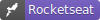

  

# 💚 Ignite 💚

 

  

    <a href="#projects">Projetos</a>&nbsp;&nbsp;&nbsp;|&nbsp;&nbsp;&nbsp;
    <a href="#autor">Autor</a>&nbsp;&nbsp;&nbsp;
  

---

### 🎯 Breve Resumo

Códigos/cursos feitos na plataforma da Rocketseat no módulo do Ignite, repositório criado para estudos/aprofundamento.

#### Descrição:

<!-- - Landing pages, formularios, menus;
- Grid, FlexBox, Sass;
- Vários cursos e projetos próprios;
- Todos muito bem documentados;
- Consumo de apis;
- Projetos em VueJs; -->

---

## 👾 Projetos 

  
  <strong>Ignite Feed</strong>

- Projeto desenvolvido para introdução aos conceitos do **React** como, componentes, props ...
- Projeto inicial que simula um feed de rede social;

- Acesse o [figma do projeto](https://www.figma.com/community/file/1113573231685349036/Ignite-Feed)

🚀 Esse projeto foi desenvolvido com as seguintes tecnologias:  

<h6></h6>

#### Desktop Screenshot:

#### Mobile Screenshot:

 

---

  
### 🚧 Projetos em fase de Construção...⏳
##### Mais projetos em breve...

---

### 👤 Autor 

**Savio Nascimento**

- 
- 

---

[⬆️ Topo](#top)
